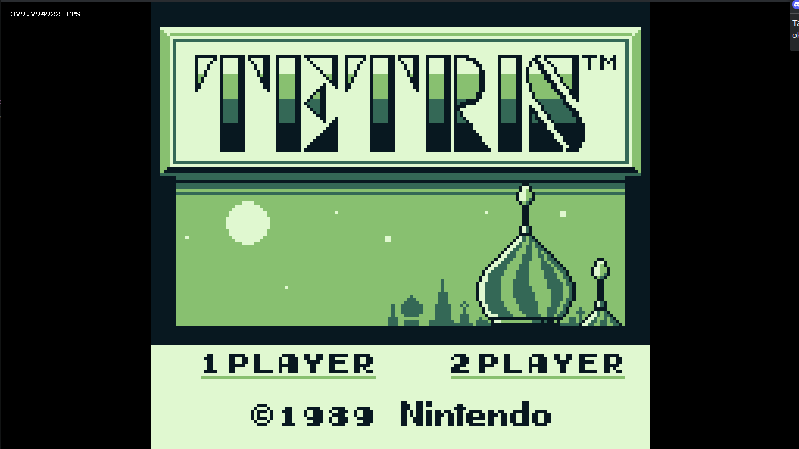

# GBE

My game boy emulator written is modern C++.

## TODO

1. Add tests for joypad
1. Timer 
1. Intergrate test cartriges to automatic tests
1. Validate all cpu tests
1. Audio
1. Add ui 
1. Save/Load States